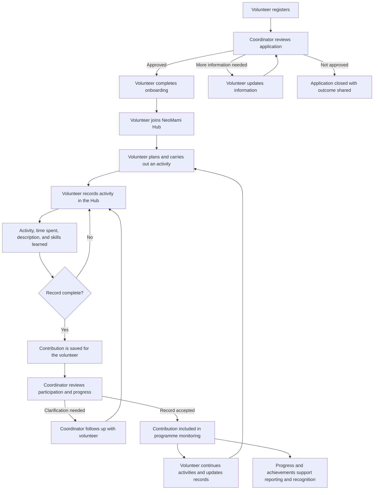

# NeoMami Hub Volunteer Process

## Purpose

NeoMami Hub gives approved volunteers a simple way to record their contribution, reflect on what they learn, and provide program coordinators with reliable evidence of participation.

The process supports three goals:

- Help volunteers participate in an organised and meaningful way.
- Give coordinators visibility of activities and volunteer effort.
- Create a clear record for programme monitoring, reporting, and recognition.

## Volunteer Journey

## Process Stages

### 1. Register

A prospective volunteer provides their details and expresses their interest in supporting the programme.

### 2. Review and approval

A programme coordinator reviews the application. The volunteer is approved, asked to provide more information, or informed that the application will not proceed.

### 3. Onboarding

An approved volunteer receives the information needed to understand their role, responsibilities, and participation expectations.

### 4. Join NeoMami Hub

The volunteer accesses NeoMami Hub after joining the programme. The Hub becomes the central place for recording their contribution.

### 5. Carry out an activity

The volunteer completes an agreed activity, such as supporting a community initiative, sharing content, or contributing time and skills to the programme.

### 6. Record the contribution

The volunteer adds a short record containing:

- What was done
- A description of the activity
- Time dedicated
- Skills learned or strengthened

The volunteer can review, update, or remove their own records when necessary.

### 7. Coordinator oversight

Coordinators can review contributions across volunteers, search records, and monitor total activities and time. They can follow up when a record needs clarification.

### 8. Monitoring, reporting, and recognition

Accepted records provide evidence for programme monitoring and reporting. They also help the organisation recognise volunteer effort and understand the skills developed through participation.

## Roles and Responsibilities

| Role | Responsibility |
|---|---|
| Volunteer | Participate in activities and keep their contribution record accurate and up to date. |
| Programme coordinator | Review applications, support volunteers, and monitor recorded participation. |
| Programme manager | Use consolidated information to understand reach, effort, progress, and outcomes. |

## What the Process Demonstrates

- **Accessible participation:** Volunteers have a clear route from registration to active contribution.
- **Accountability:** Each activity is documented by the person who completed it.
- **Visibility:** Coordinators can see participation across the programme.
- **Continuous improvement:** Follow-up questions help improve the quality of records.
- **Evidence for public reporting:** Activities, time, and learning can be summarised for programme updates.
- **Recognition of volunteers:** Consistent records make individual and collective contributions easier to acknowledge.

## Suggested Presentation Message

> NeoMami Hub turns volunteer participation into a clear, supported, and measurable journey: volunteers join, contribute, record what they do, and receive ongoing coordination. The organisation gains dependable evidence of community effort while volunteers gain recognition for the time and skills they contribute.
