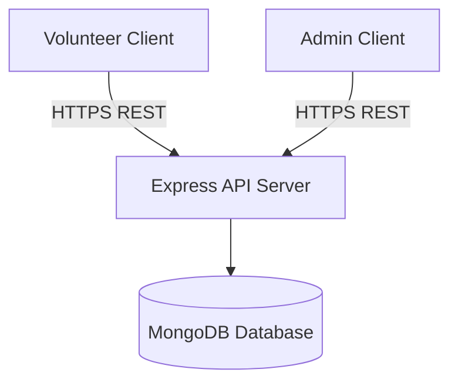

# PY4P Volunteer Management System (VMS) - Official Engineering Manual

This is the primary repository documentation and developer manual for the **PY4P Volunteer Management System (VMS)**. This project has been fully audited and documented for production operations.

For modular documentation, refer to the [docs/](file:///d:/TSF/tsf-vms-flutter/docs/) folder.

---

## 1. Project Overview

### Business Purpose & Goals
The **PY4P VMS** is designed to digitize and automate the lifecycle of volunteer operations for the Pathways for Purpose (PY4P) organization. It supports volunteer onboarding, training schedules, mentoring call tracking, administrative reviews, and certification checks.

### Business Workflow & Capabilities
1. **Onboarding**: Registrations submitted via [register_screen.dart](file:///d:/TSF/tsf-vms-flutter/lib/register_screen.dart) are approved/rejected by admins via [admin.dart](file:///d:/TSF/tsf-vms-flutter/lib/admin.dart).
2. **Training & Mentoring**: Approved users move to scheduled training. Active mentors are assigned a mentee ([admin_mentee_management.dart](file:///d:/TSF/tsf-vms-flutter/lib/admin_mentee_management.dart)) and log mentoring logs ([companionconnect.dart](file:///d:/TSF/tsf-vms-flutter/lib/companionconnect.dart)).
3. **Analytics**: Administrative staff monitor well-being metrics (Mood, Self-Esteem) and milestones on [enhanced_vms_dashboard_screen.dart](file:///d:/TSF/tsf-vms-flutter/lib/screens/admin/enhanced_vms_dashboard_screen.dart).
4. **Certification**: Eligible volunteers receive completion certificates generated in [certificate_management_screen.dart](file:///d:/TSF/tsf-vms-flutter/lib/screens/admin/certificate_management_screen.dart).

### Limitations
- **Backend Dependency**: Express backend database layers are hosted externally (Koyeb / ngrok).
- **Offline Operations**: Local queueing or synchronization layers are: `Unable to determine from repository`.
- **Push Notifications**: Missing native APNS/FCM triggers; relies on client polling.

---

## 2. High Level Architecture

The application is structured around a three-tier architecture:
- **Client (Frontend)**: Flutter app (iOS, Android, Web) using `ChangeNotifierProvider` for state management ([notification_provider.dart](file:///d:/TSF/tsf-vms-flutter/lib/providers/notification_provider.dart)).
- **Application (Backend)**: Inferred Node.js Express API.
- **Data (Database)**: Inferred MongoDB database layer.

### System Data Flow


---

## 3. Complete Folder Structure

- **[android/](file:///d:/TSF/tsf-vms-flutter/android)**: Native Android Gradle scripts and workspace wrappers. Includes keystore configurations.
- **[assets/](file:///d:/TSF/tsf-vms-flutter/assets)**: Image binaries (`logo.png`) and animations (`register.lottie`).
- **[ios/](file:///d:/TSF/tsf-vms-flutter/ios)**: Xcode projects and target configurations.
- **[lib/](file:///d:/TSF/tsf-vms-flutter/lib)**: Flutter source codebase:
  - **[config/](file:///d:/TSF/tsf-vms-flutter/lib/config)**: Configures Base URLs ([api_config.dart](file:///d:/TSF/tsf-vms-flutter/lib/config/api_config.dart)) and style guides ([app_colors.dart](file:///d:/TSF/tsf-vms-flutter/lib/config/app_colors.dart)).
  - **[models/](file:///d:/TSF/tsf-vms-flutter/lib/models)**: Serialization templates (e.g. [volunteer_model.dart](file:///d:/TSF/tsf-vms-flutter/lib/models/volunteer_model.dart)).
  - **[providers/](file:///d:/TSF/tsf-vms-flutter/lib/providers)**: Provider model listeners ([notification_provider.dart](file:///d:/TSF/tsf-vms-flutter/lib/providers/notification_provider.dart)).
  - **[screens/](file:///d:/TSF/tsf-vms-flutter/lib/screens)**: Layout controllers split into `admin/` and `volunteer/` screens.
  - **[services/](file:///d:/TSF/tsf-vms-flutter/lib/services)**: Services for HTTP transactions (e.g. [vms_service.dart](file:///d:/TSF/tsf-vms-flutter/lib/services/vms_service.dart)).
  - **[widgets/](file:///d:/TSF/tsf-vms-flutter/lib/widgets)**: UI blocks (e.g. [enhanced_metrics_widgets.dart](file:///d:/TSF/tsf-vms-flutter/lib/widgets/enhanced_metrics_widgets.dart)).
- **[web/](file:///d:/TSF/tsf-vms-flutter/web)**: Static HTML templates and progressive web manifestations.
- **[test/](file:///d:/TSF/tsf-vms-flutter/test)**: Contains client UI test suite ([widget_test.dart](file:///d:/TSF/tsf-vms-flutter/test/widget_test.dart)).

---

## 4. Technology Stack & Environment

- **Flutter / Dart SDK**: version `^3.7.2` (chosen for cross-platform rendering).
- **Secure Storage**: `flutter_secure_storage` ^9.2.4 (used for EncryptedSharedPreferences on Android and Keychain on iOS).
- **HTTP Client**: `http` ^1.2.0.
- **Environment Variables**: Managed inside code through the `ApiConfig` class ([api_config.dart](file:///d:/TSF/tsf-vms-flutter/lib/config/api_config.dart)). Toggles target endpoints between development (ngrok) and production (Koyeb).

---

## 5. Local Development Guide

### Prerequisites
- Install Flutter SDK `3.7.x` and Dart SDK `3.7.x`.

### Installation Steps
1. Clone the repository.
2. Retrieve dependencies:
   ```bash
   flutter pub get
   ```
3. Set environment base URL: Open [api_config.dart](file:///d:/TSF/tsf-vms-flutter/lib/config/api_config.dart) and configure `kIsDebug = true` (for local ngrok tunnels) or `false` (for Koyeb production).
4. Run client:
   ```bash
   # Run on default connected emulator
   flutter run
   # Run web app
   flutter run -d chrome
   ```
5. Execute tests:
   ```bash
   flutter test
   ```

---

## 6. Comprehensive Database Documentation

MongoDB collections schema (documented in [docs/05_Database.md](file:///d:/TSF/tsf-vms-flutter/docs/05_Database.md)):
- **Users**: Core logins and platform access privileges.
- **Volunteers**: Track location, skills, tenure days, and lifecycle progression stages.
- **CallSessions**: Call details, durations, checklists, comfort scores, and admin ratings.
- **Mentees**: Beneficiaries paired with mentors.
- **Notifications**: System notification records.
- **Queries**: Volunteer questions and corresponding admin replies.

### Indexes
- Unique index on Volunteer `volunteerCode` and `email` collections.
- Compound index on CallSessions `{ volunteerId: 1, callDate: -1 }`.

---

## 7. API Routing

Endpoints are mapped in [docs/06_API.md](file:///d:/TSF/tsf-vms-flutter/docs/06_API.md). Highlights include:
- `POST /api/auth/send-otp`: Sends OTP verification codes to email.
- `POST /api/auth/verify-otp`: Validates OTP and returns JWT tokens.
- `GET /api/admin/vms/dashboard`: Returns aggregate lifecycle counts.
- `GET /api/admin/vms/dashboard/enhanced`: Returns advanced metrics (Mood average, Self-esteem, total hours) filtered by date parameters (`3days`, `week`, `month`, `all`).
- `POST /api/companion-connect/notes`: Logs mentoring call records.
- `GET /api/notifications`: Retrieves unread notification cards.

---

## 8. Authentication & Authorization Flows

Detailed in [docs/16_Sequence_Diagrams.md](file:///d:/TSF/tsf-vms-flutter/docs/16_Sequence_Diagrams.md) and [docs/09_Security.md](file:///d:/TSF/tsf-vms-flutter/docs/09_Security.md):
- **Authentication**: passwordless OTP-based email verification workflow. Session tokens are saved on local secure storage.
- **Authorization**: Middleware on Express validates token roles. Routes starting with `/admin` require the `"admin"` role. Non-subscribed volunteers are denied access (returning `403 Forbidden`) to protected program routes (like Neomami Hub).

---

## 9. Frontend Guide
- **Navigation Routing**: Defined dynamically inside [main.dart](file:///d:/TSF/tsf-vms-flutter/lib/main.dart#L57-L110).
- **Themes**: App colors are declared in [app_colors.dart](file:///d:/TSF/tsf-vms-flutter/lib/config/app_colors.dart). Font is configured as standard Poppins.
- **Form Controls & Validations**: Validation logic checks phone numbers, email structures, and mentoring call lengths before triggering POST requests.

---

## 10. Admin Panel & Controls
Admin dashboard screens (in `lib/screens/admin/`) provide full configuration privileges:
- **Approval Console** ([admin.dart](file:///d:/TSF/tsf-vms-flutter/lib/admin.dart)): Allows approvals/rejections and hard deletions.
- **Certificate Management** ([certificate_management_screen.dart](file:///d:/TSF/tsf-vms-flutter/lib/screens/admin/certificate_management_screen.dart)): Scans database records and releases certification state values.
- **Neomami Hub Panel** ([neomami_admin_screen.dart](file:///d:/TSF/tsf-vms-flutter/lib/screens/admin/neomami_admin_screen.dart)): Monitors volunteer contribution records.

---

## 11. AI / RAG & OCR
- **AI / RAG**: `Unable to determine from repository`. No AI models, prompt logs, or vector indexing are present in the files.
- **OCR**: `Unable to determine from repository`. No optical character processing modules exist.

---

## 12. Security Audit & Critical Alerts

### Committed Android Signing Keystores
- **Alert**: The Android keystore binary [upload-keystore.jks](file:///d:/TSF/tsf-vms-flutter/upload-keystore.jks) and upload certificates are committed to version control.
- **Severity**: **Medium**.
- **Fix**: Reconfigure build Gradle dependencies to fetch keystore secrets from system environment variables inside deployment pipelines.

---

## 13. Maintainer Handover Checklist

For engineering handover details, read [docs/10_Handover.md](file:///d:/TSF/tsf-vms-flutter/docs/10_Handover.md):
- **Critical Business Rules**: Volunteers cannot enter the mentoring stage without completing training. Certificates require 3 months of mentoring and completed exit handovers.
- **High Churn Areas**: Changes to the polling timer inside [notification_provider.dart](file:///d:/TSF/tsf-vms-flutter/lib/providers/notification_provider.dart) might cause performance issues.
- **Critical Environment variables**: Update Koyeb endpoint variables on server failures.
