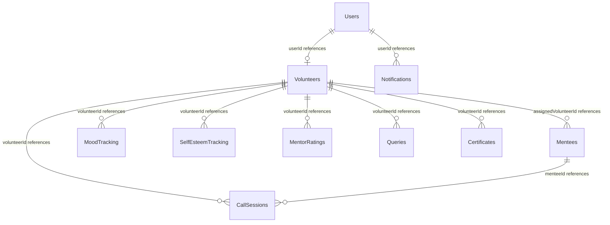

# Database Documentation - MongoDB

The backend database for the VMS project is a **MongoDB** deployment, modeled through Mongoose schemas on the Express API server. The details below are documented based on [PROCESS_REPORT.md](file:///d:/TSF/tsf-vms-flutter/PROCESS_REPORT.md).

---

## 1. Database Entity Relationship (ER) Diagram

---

## 2. Collection Schemas & Models

### 2.1 Users Collection
Stores credential wrappers and platform roles.
- `_id`: ObjectId (Primary Key)
- `email`: String (Unique, Indexed)
- `password`: String (Hashed password, used for administrative accounts)
- `role`: String (Enums: `volunteer`, `admin`, `mentee`)
- `createdAt`: Date
- `updatedAt`: Date

### 2.2 Volunteers Collection
Stores volunteer profile data, lifecycle progress state, and analytics summaries.
- `_id`: ObjectId (Primary Key)
- `userId`: ObjectId (Foreign Key -> Users)
- `volunteerCode`: String (Unique index, pattern: `PY4P-2025-XXXX`)
- `firstName`: String
- `lastName`: String
- `fullName`: String
- `email`: String
- `phone`: String
- `photoUrl`: String
- `currentLocation`: String
- `approvalStatus`: String (Enums: `pending`, `approved`, `rejected`)
- `dateOfJoining`: Date
- `dateOfExit`: Date
- `onboardingStatus`: String (Enums: `not_started`, `in_progress`, `completed`)
- `trainingStatus`: String (Enums: `not_started`, `scheduled`, `in_progress`, `completed`)
- `trainingScheduledDate`: Date
- `mentoringStatus`: String (Enums: `not_mentoring`, `active`, `completed`)
- `exitStatus`: String (Enums: `none`, `requested`, `handover_pending`, `handover_completed`, `exited`)
- `exitReason`: String
- `handoverDetails`: Object
  - `childName`: String
  - `childCurrentStatus`: String
  - `handoverNotes`: String
  - `completedDate`: Date
- `certificateEligible`: Boolean
- `certificateIssued`: Boolean
- `certificateIssuedDate`: Date
- `volunteeringDurationDays`: Number
- `volunteeringDurationMonths`: Number
- `skills`: Array of Strings
- `preferredRoles`: Array of Strings
- `linkedIn`: String
- `emergencyContact`: String
- `emergencyRelation`: String
- `interestedPrograms`: Array of Strings (e.g. `['Companion Connect', 'Neomami Hub']`)
- `callStats`: Object
  - `totalCalls`: Number
  - `totalCallHours`: Number
  - `averageCallDuration`: Number
  - `lastCallDate`: Date
- `gamification`: Object
  - `currentCallCount`: Number
  - `callGoal`: Number (Default: 12)
  - `milestonesAchieved`: Array of Numbers (e.g. `[3, 6, 9, 12]`)
  - `completionDate`: Date
- `createdAt`: Date
- `updatedAt`: Date

### 2.3 Mentees Collection
Stores mentee records. Used in the Companion Connect Program (CCP).
- `_id`: ObjectId (Primary Key)
- `name`: String
- `age`: Number (Inferred or calculated)
- `gender`: String
- `location`: String
- `assignedVolunteerId`: ObjectId (Foreign Key -> Volunteers, Nullable)
- `assignmentDate`: Date
- `assignmentStatus`: String (Enums: `assigned`, `unassigned`, `completed`)
- `backgroundInfo`: String
- `specialNeeds`: String
- `guardianContact`: Object
  - `name`: String
  - `phone`: String
  - `relation`: String
- `createdAt`: Date
- `updatedAt`: Date

### 2.4 CallSessions Collection
Logs call mentoring metrics, well-being metrics, and admin ratings.
- `_id`: ObjectId (Primary Key)
- `volunteerId`: ObjectId (Foreign Key -> Volunteers)
- `menteeId`: ObjectId (Foreign Key -> Mentees)
- `callDate`: Date
- `callNumber`: Number (Sequential session counter: 1 to 12)
- `duration`: Number (Call duration in minutes)
- `moodScore`: Number (Score scale: 1 to 10)
- `volunteerComfort`: Number (Comfort scale: 1 to 10)
- `mentorHelpfulness`: String (Enums: `Yes`, `Somewhat`, `No`)
- `topicsDiscussed`: Array of Strings (e.g. `['Studies', 'Family', 'Health']`)
- `checklistItems`: Array of Objects
  - `label`: String
  - `isAchieved`: Boolean
- `assistanceRequests`: Array of Strings
- `otherAssistanceDetail`: String
- `redFlags`: String
- `volunteerNotes`: String
- `callQualityRating`: Number (Rating: 1 to 5 stars, set by administrator)
- `callQualityNotes`: String
- `ratedBy`: ObjectId (Foreign Key -> Users)
- `ratedAt`: Date
- `createdAt`: Date
- `updatedAt`: Date

### 2.5 MoodTracking Collection
Stores mood records logged over time.
- `_id`: ObjectId
- `volunteerId`: ObjectId (Foreign Key -> Volunteers)
- `menteeId`: ObjectId (Foreign Key -> Mentees)
- `score`: Number (1 to 10)
- `recordedDate`: Date
- `callSessionId`: ObjectId (Foreign Key -> CallSessions)
- `notes`: String
- `createdAt`: Date

### 2.6 SelfEsteemTracking Collection
Stores self-esteem scores logged over time.
- `_id`: ObjectId
- `volunteerId`: ObjectId (Foreign Key -> Volunteers)
- `menteeId`: ObjectId (Foreign Key -> Mentees)
- `score`: Number (1 to 10)
- `recordedDate`: Date
- `callSessionId`: ObjectId (Foreign Key -> CallSessions)
- `notes`: String
- `createdAt`: Date

### 2.7 MentorRatings Collection
Stores mentee ratings and feedback.
- `_id`: ObjectId
- `volunteerId`: ObjectId (Foreign Key -> Volunteers)
- `menteeId`: ObjectId (Foreign Key -> Mentees)
- `rating`: Number (1 to 5 stars)
- `feedback`: String
- `learningOutcomes`: Array of Objects
  - `outcome`: String
  - `achievedDate`: Date
  - `ratingByMentee`: Number
  - `feedback`: String
- `ratedDate`: Date
- `createdAt`: Date

### 2.8 Queries Collection
Logs queries submitted by volunteers for administrative answers.
- `_id`: ObjectId
- `volunteerId`: ObjectId (Foreign Key -> Volunteers)
- `queryText`: String
- `category`: String (Enums: `technical`, `process`, `mentee-related`, `other`)
- `status`: String (Enums: `pending`, `replied`, `resolved`)
- `adminResponse`: String
- `respondedBy`: ObjectId (Foreign Key -> Users)
- `respondedAt`: Date
- `createdAt`: Date
- `updatedAt`: Date

### 2.9 Notifications Collection
Logs system notifications.
- `_id`: ObjectId
- `userId`: ObjectId (Foreign Key -> Users)
- `title`: String
- `message`: String
- `type`: String (Enums: `general`, `application`, `training`, `query`, `milestone`)
- `isRead`: Boolean
- `readAt`: Date
- `emailSent`: Boolean
- `metadata`: Schema.Types.Mixed (Object containing dynamic context references)
- `createdAt`: Date

### 2.10 Programs Collection
Defines available impact programs (e.g. Companion Connect, Neomami Hub).
- `_id`: ObjectId
- `name`: String
- `description`: String
- `order`: Number
- `isActive`: Boolean
- `enrollmentOpen`: Boolean
- `createdAt`: Date
- `updatedAt`: Date

### 2.11 Certificates Collection
Records certificates issued to volunteers.
- `_id`: ObjectId
- `volunteerId`: ObjectId (Foreign Key -> Volunteers)
- `certificateUrl`: String
- `issuedDate`: Date
- `issuedBy`: ObjectId (Foreign Key -> Users)
- `certificateCode`: String (Unique)
- `isValid`: Boolean
- `createdAt`: Date

---

## 3. Database Indexes
The following database indexes are applied (documented in [PROCESS_REPORT.md](file:///d:/TSF/tsf-vms-flutter/PROCESS_REPORT.md#L1188-L1209)):
- **Volunteers**:
  - `email`: 1 (Unique)
  - `volunteerCode`: 1 (Unique)
  - `approvalStatus`: 1
  - `onboardingStatus`: 1
  - `mentoringStatus`: 1
  - `exitStatus`: 1
  - `certificateEligible`: 1
- **CallSessions**:
  - `{ volunteerId: 1, callDate: -1 }`
  - `{ menteeId: 1, callDate: -1 }`
  - `callDate`: -1 (for time-range dashboard queries)
- **Notifications**:
  - `{ userId: 1, isRead: 1, createdAt: -1 }`
  - `{ userId: 1, createdAt: -1 }`
- **Mentees**:
  - `assignedVolunteerId`: 1
  - `assignmentStatus`: 1

---

## 4. Known Issues & Validations
- **Eligibility Validation**: The `certificateEligible` calculation was updated to require `volunteeringDurationMonths >= 3`, `exitStatus === 'handover_completed'`, and `mentoringStatus === 'completed'` to prevent issuing certificates prior to completing handovers.
- **Migration History**: `Unable to determine from repository`. No database migration folder or configuration histories are checked in this repository.
