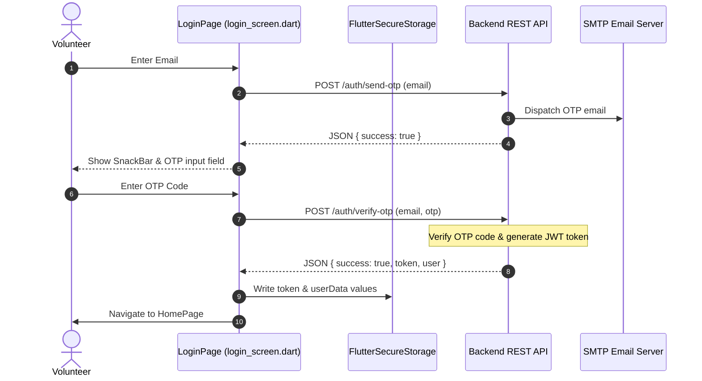
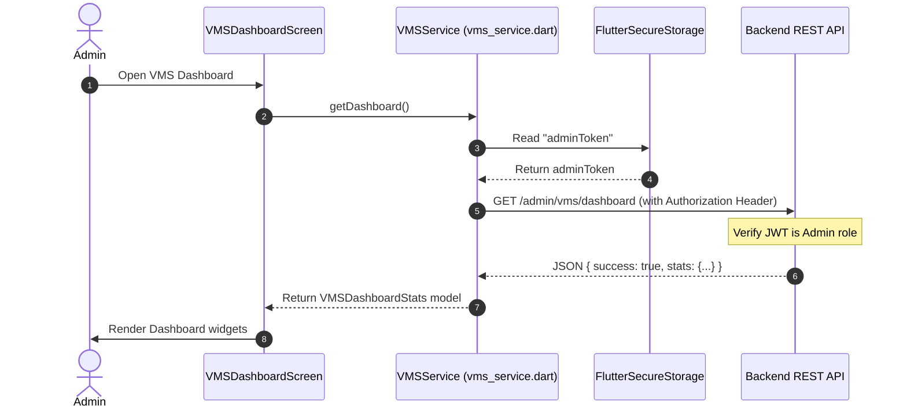
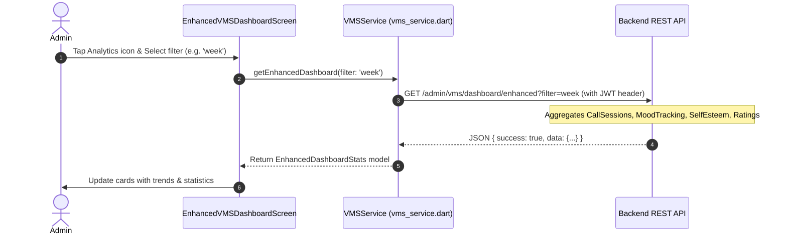
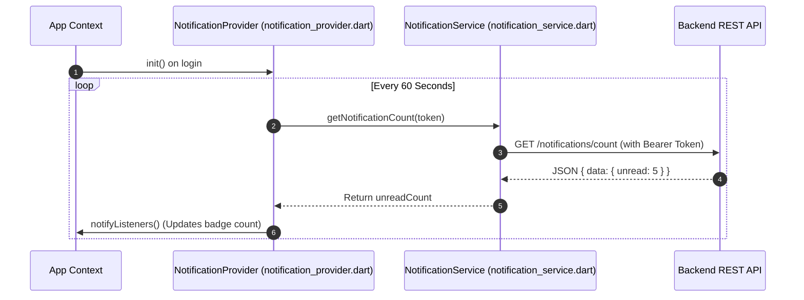

# System Sequence Diagrams

This document contains sequence diagrams for the system's core workflows: Authentication, Dashboard Loading, Analytics, and Notifications.

---

## 1. User Authentication Flow (OTP-Based Login)
Volunteers log in without passwords using OTP codes sent to their emails.

---

## 2. Dashboard Loading Data Flow
Admin requests statistical totals for all volunteers.

---

## 3. Enhanced Metrics Flow (Advanced Analytics)
Admin loads aggregated analytics filtered by date range.

---

## 4. Polling Notification Flow
Monitors new notifications in the background.

